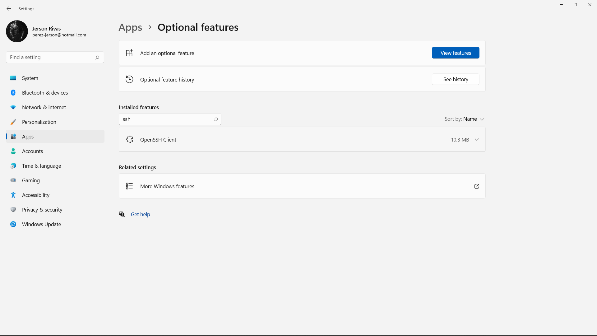

# **Lab Report - Week 2**

## In this weeks report we'll see how to:

```
1. Install VScode
2. Remotely Connect
3. Try Some Commands
4. Move Files with scp
5. Setting an SSH Key
7. Optimizing Remote Running
``` 
---
### Insatlling VScode:
>For the first step, we will need to install VScode, which is the editor that we will use.  
First we need to go to [https://code.visualstudio.com](https://code.visualstudio.com) and download it.

It should look something like this once you open it:


 ---
### Remotely Connect:  
  
>In this step we are going to connect to a server to do 
work there. This is pretty useful because you can do work from any part of the world that has internet connection.  

There is a couple steps in order to do this. The first one (for windows) is to install OpenSSh. This program will allow us to connect to other computers.

 Newer versions of windows as 10 and 11 often have this already installed. You can check it by going to **Settings → Apps → Optional Features** and search for SSH. It should appear there.  
In case it is not installed, just click on add features and search it there.



After this, we go to VScode and open a new terminal. In the terminal we need to input the following command:

**Note: replace zz by the letter in your account. you can find it [here](https://sdacs.ucsd.edu/~icc/index.php).**

    $ ssh cs15lwi22zz@ieng6.ucsd.edu

After that, you will receive this message:

    ⤇ ssh cs15lwi22zz@ieng6.ucsd.edu
    The authenticity of host 'ieng6.ucsd.edu (128.54.70.227)' can't be established.
    RSA key fingerprint is SHA256:ksruYwhnYH+sySHnHAtLUHngrPEyZTDl/1x99wUQcec.
    Are you sure you want to continue connecting (yes/no/[fingerprint])? 
Type yes, and enter your password. 

```
⤇ ssh cs15lwi22zz@ieng6.ucsd.edu
The authenticity of host 'ieng6-202.ucsd.edu (128.54.70.227)' can't be established.
RSA key fingerprint is SHA256:ksruYwhnYH+sySHnHAtLUHngrPEyZTDl/1x99wUQcec.
Are you sure you want to continue connecting (yes/no/[fingerprint])? 
Password: 
Last login: Sun Jan  2 14:03:05 2022 from 107-217-10-235.lightspeed.sndgca.sbcglobal.net
quota: No filesystem specified.
Hello cs15lwi22zz, you are currently logged into ieng6-203.ucsd.edu

You are using 0% CPU on this system

Cluster Status 
Hostname     Time    #Users  Load  Averages  
ieng6-201   23:25:01   0  0.08,  0.17,  0.11
ieng6-202   23:25:01   1  0.09,  0.15,  0.11
ieng6-203   23:25:01   1  0.08,  0.15,  0.11

Sun Jan 02, 2022 11:28pm - Prepping cs15lwi22
```
This should appear next. That means that you succesfuly connected to the server.

---
### Try Some Commands:
> In this step we are going to explore some commands that will be useful for different practices.


Try running the commands cd, ls, pwd, mkdir, and cp a few times in different ways, both on your computer, and on the remote computer after ssh-ing. Discuss in your group what you see. Can you cause them to produce error messages? What do they mean? If you’re on Windows, what happens when you use them on Windows?

Here are some specific useful commands to try:
