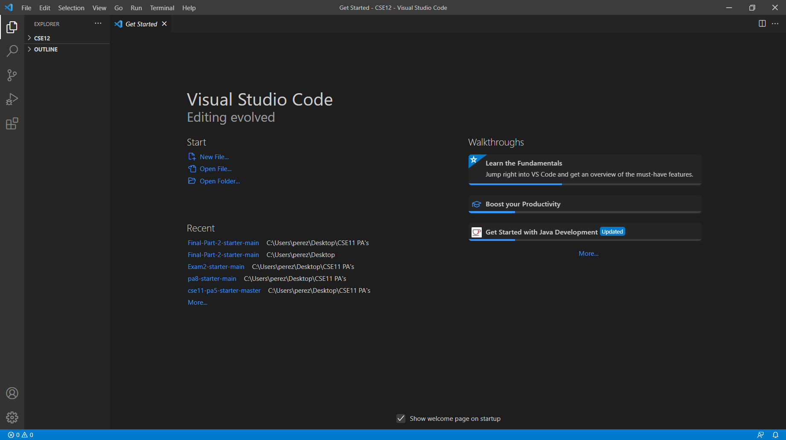

# **Lab Report - Week 2**

## In this weeks report we'll see how to:

```
1. Install VScode
2. Remotely Connect
3. Try Some Commands
4. Move Files with scp
5. Setting an SSH Key
6. Optimizing Remote Running
``` 
---
### Insatlling VScode:
>For the first step, you will need to install VScode, which is the editor that you will use.  
Just go to [https://code.visualstudio.com](https://code.visualstudio.com) and download it.

It should look something like this once you open it:



 ---
### Remotely Connect:  
  
>In this step we are going to connect to a server to do 
work there. This is pretty useful because you can do work from any part of the world that has internet connection.  

There is a couple steps in order to do this. The first one is to install OpenSSh. In my case it was already installed. To check this go to **Settings → Apps → Optional Features** and search for SSH. 
In case it is not installed, just click on add features and search it there.


After this, let's go to VScode and open a new terminal. In the terminal I typed the following command:


    $ ssh cs15lwi22asi@ieng6.ucsd.edu

After that, this message appears:

    ⤇ ssh cs15lwi22asi@ieng6.ucsd.edu
    The authenticity of host 'ieng6.ucsd.edu (128.54.70.227)' can't be established.
    RSA key fingerprint is SHA256:ksruYwhnYH+sySHnHAtLUHngrPEyZTDl/1x99wUQcec.
    Are you sure you want to continue connecting (yes/no/[fingerprint])? 
Just typed yes, and entered the password. 

 

This appeared next. That means a succesful connection to the server has been stablished.

---
### Try Some Commands:
> In this step I tried some commands that areb useful for different practices.

These are the commands I used:

* cd ~
* cd
* ls -a
* ls -lat
* cp /home/linux/ieng6/cs15lwi22/public/hello.txt ~/
* cat /home/linux/ieng6/cs15lwi22/public/hello.txt
* exit

 
 
 This is the output I got.

 ---

### Moving Files with scp:
> In this part I had to copy a file from my local computer to the remote server. This was done using scp.

To test this, I created the WhereAmI.java file wchich basically was a program that its output was the operating system, the name of the user among other things.

First, I ran this in my computer. After that, I copied the file to the remote computer using this command:

    scp WhereAmI.java cs15lwi22asi@ieng6.ucsd.edu:~/
 Then I executed the program in the server and got this:

 

 ---
 ### Setting an SSH Key:
 > In this step I implemented an SSH key to be able to log in without a password.

 In order to do this I opened powershell and typed <mark>ssh-keygen -t ed25519</mark>

 This appeared next and I just hit enter: 

    Generating public/private ed25519 key pair.
    Enter file in which to save the key (C:\Users\username\.ssh\id_ed25519):

After this, the terminal should disply this message meaning that the key was generated:

 


