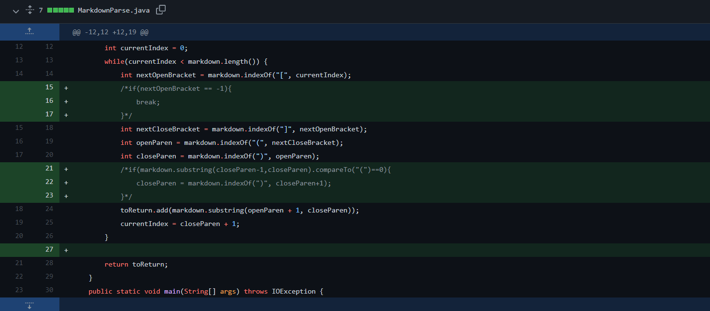
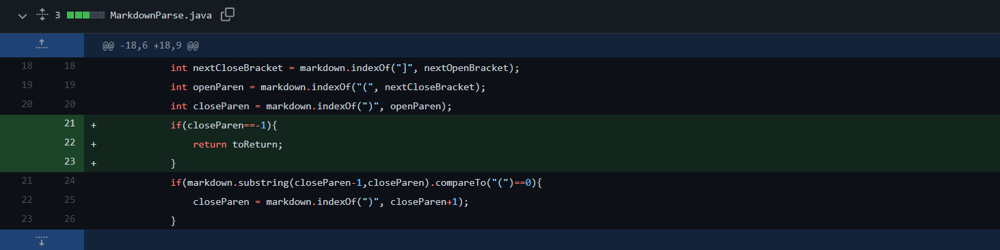
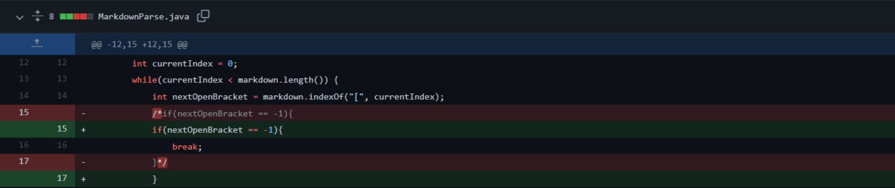

# **Lab Report - Week 4**

**For this lab we looked at the file MarkdownParse.java and make changes to pass the following test cases:**


>Test 1: was a normal link with parenthesis inside it.  
 ```-goog()le.com```

>Test 2: was a normal link, and one lacking the end parenthesis.  
```-[a-link] (www.google.com```  
 ```-[Lab Report 1](lab-report-1-week-2.html)```

>Test 3:
 ```-was an empty file```

### The first change done was the one that follows:



> Here is the link to the first test: [Test 1](https://github.com/Ironhide692/markdown-parse/blob/e20013ee9242b37aeccf6be73826b85c85c9a84c/breaking-test.md)

For this test the following result was returned in the terminal:

```
Exception in thread "main" java.lang.OutOfMemoryError: Java heap space
    at java.base/java.util.Arrays.copyOfRange(Arrays.java:3822)
    at java.base/java.lang.StringLatin1.newString(StringLatin1.java:769)
    at java.base/java.lang.String.substring(String.java:2709)
    at MarkdownParse.getLinks(MarkdownParse.java:24)
    at MarkdownParse.main(MarkdownParse.java:33)
```
Here we can see that the loop is runing to find the parenthesis until the end. The symptom here is that because we have parenthesis inside the link, the program is confused, so it causes an infinite loop. Thus, we changed the condition of the loop to fix that case.

---

### The second change done was the one that follows:



> Here is the link to the second test: [Test 2](https://github.com/Ironhide692/markdown-parse/blob/e20013ee9242b37aeccf6be73826b85c85c9a84c/breaking-test2.md)

For this test the following result was returned in the terminal:

```
Exception in thread "main" java.lang StringIndexOutOfBoundsException: begin -2, end -1, length 24
    at java.base/java.lang.String.checkBoundsBeginEnd(String.java:4601)
    at java.base/java.lang.String.substring(String.java:2704)
    at MarkdownParse.getLinks(MarkdownParse.java:21)
    at MarkdownParse.main(MarkdownParse.java:36)
```
Here we can see that the symptom is caused because we do not have end parenthesis and have another link after that, thus the program continues to read and produces that output. We came to the conclusion that we needed a solution to end the program before reaching that parenthesis. The solution was to return only the string when a parenthesis is not found.

---

### The third change done was the one that follows:



> Here is the link to the second test: [Test 3](https://github.com/Ironhide692/markdown-parse/blob/e20013ee9242b37aeccf6be73826b85c85c9a84c/breaking-test3.md)


Surprisingly for this test we did not face any error and the returned output was nothing as expected. Therefore we did not chaange the code, and just edited somethings to make it more efficient. 

We only added the following statement:

```
if(nextOpenBracket == -1){
        break;
}

```
This just serves to end the loop if the file is empty, or does not contain any links. This makes the program faster, and also tackles the case of having something that is not a link.
