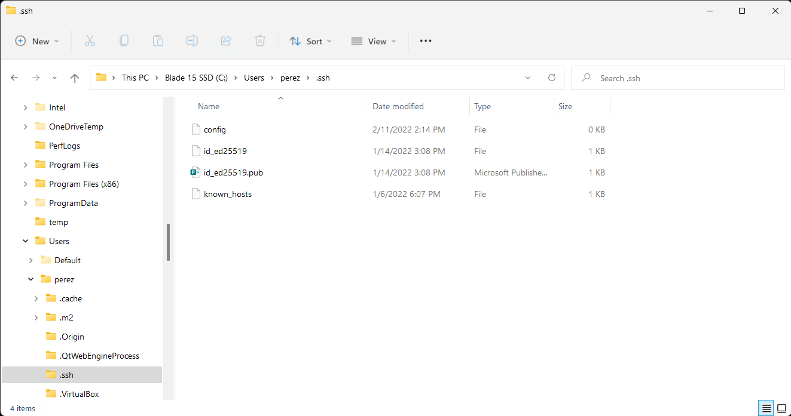
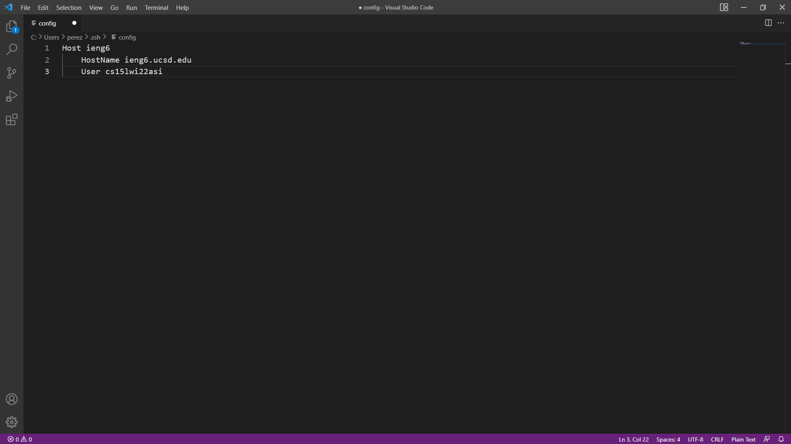
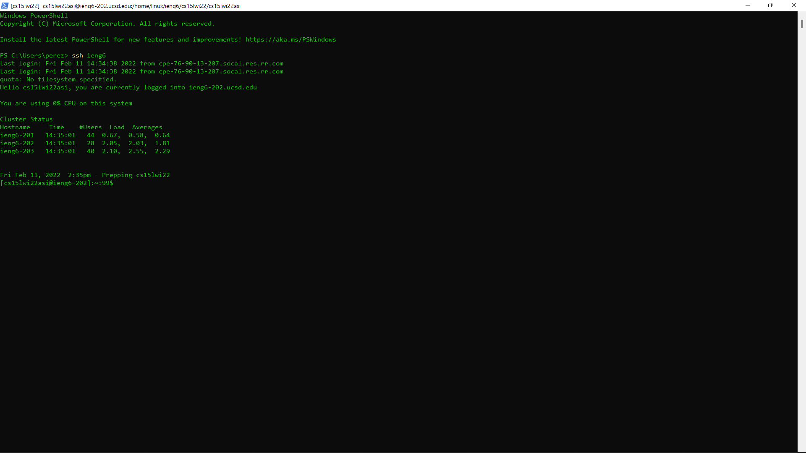
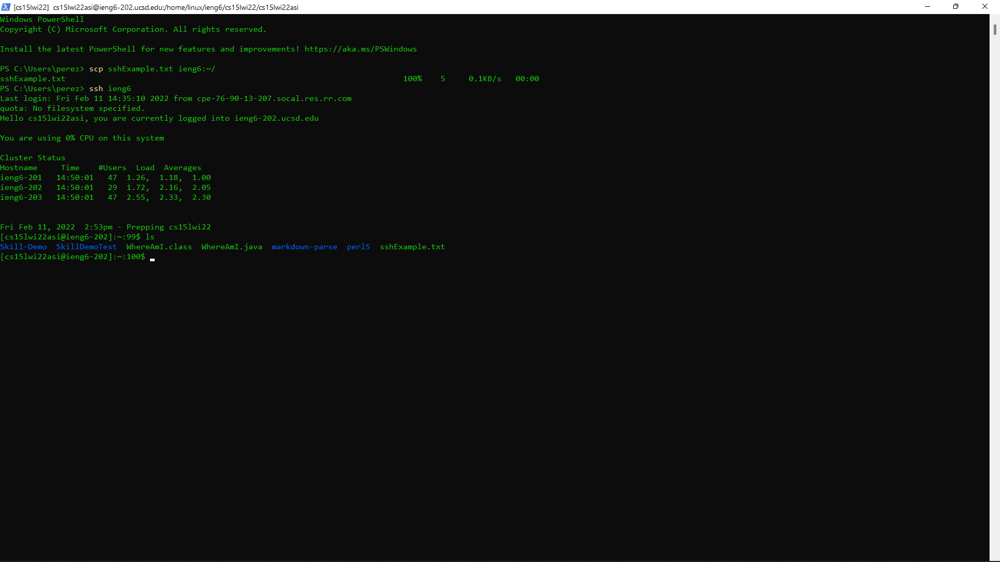

# **Lab Report - Week 6**

## For this lab report we will se how to Streamline <mark>ssh</mark> Configuration:

Everytime we want to access the remote server we have to type the command ssh followed by our username in the form 'cse15lwi22zz@ieng6.ucsd.edu'. This is a long typing, so to make it more efficient we configure ssh in order to only access by doing <mark>ssh ieng6</mark>.

---
### Firts we have to find our .shh folder in our computer to acces our keys:

>Usually this can be found by going to your main storage unit > Users > the user you want > .ssh

After this, we create a new file called config without any extension.



 ---
### For the second step we will configure the config file:

We open the config file in VScode and type the following and save it:

```
Host ieng6
    HostName ieng6.ucsd.edu
    User (your username in form cs15lwi22zz)
```


---

### For the third step just try to connect to the server using ssh ieng6:

The next should appear meaning that you connected successfuly:



>note that ieng6 can be changed for any other word to log in.

Thanks to this configuration, we can also do this for scp.
Just use <mark>scp (filename) ieng6:~/</mark> and it should copy the file to the server.



