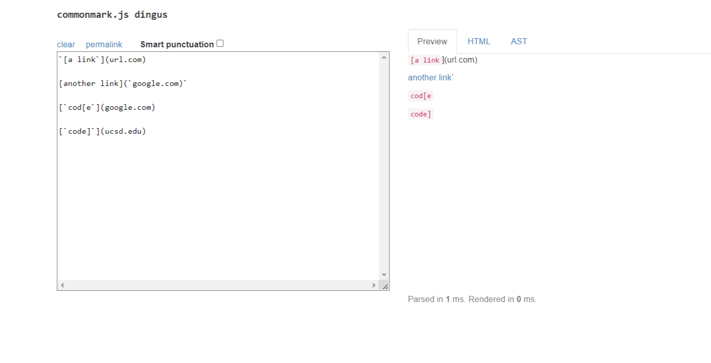
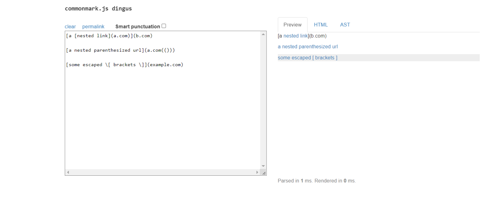
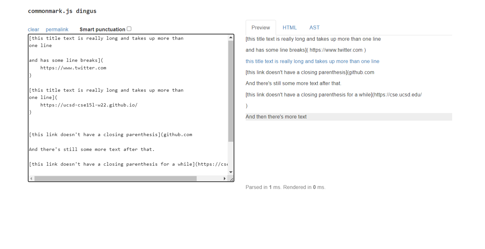
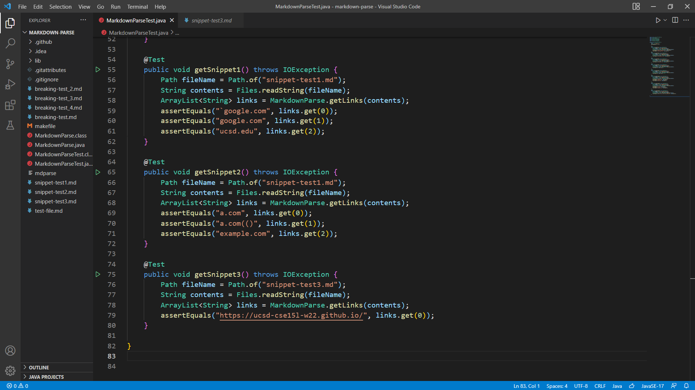
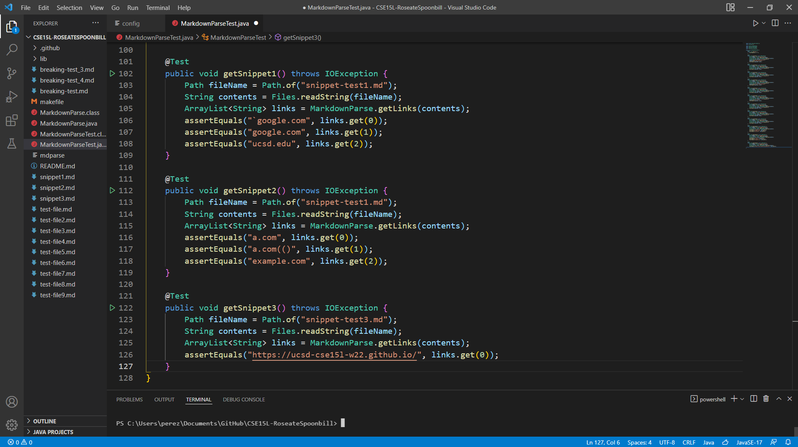
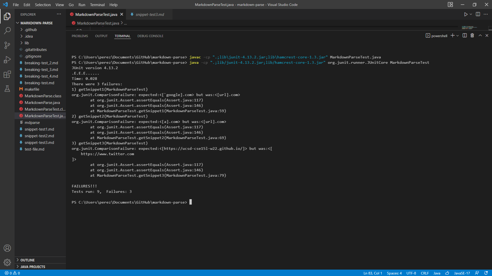
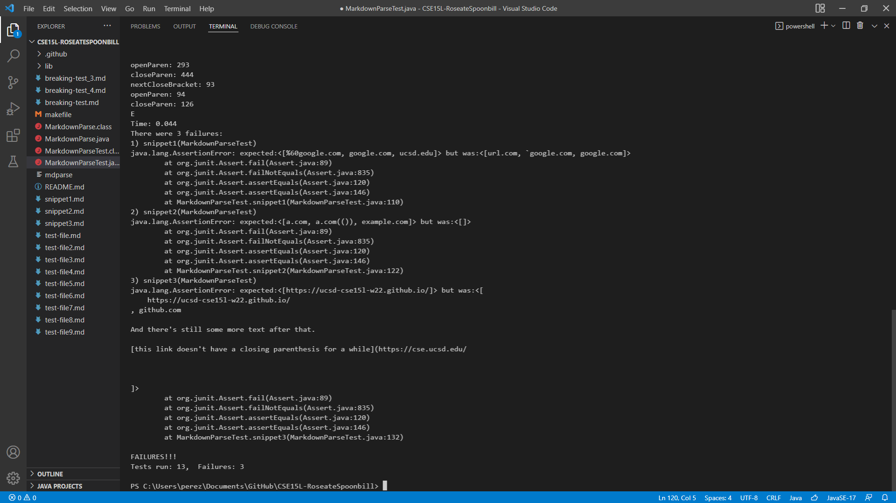

# **Lab Report - Week 8**

## Repositories Used:

* [Reviewed Repository](https://github.com/CatherineGu16/markdown-parse.git)

* [My Repositoriy](https://github.com/Ironhide692/markdown-parse.git)

---

### Snippet 1:

---

### Snippet 2:

---

### Snippet 3:

---

### Adding Tests:

#### My group's tests:

#### Reviewed group tests:

---

### Results:

#### My group:

#### Reviewed group:

---

### Questions:

**1. Do you think there is a small (<10 lines) code change that will make your program work for snippet 1 and all related cases that use inline code with backticks? If yes, describe the code change. If not, describe why it would be a more involved change.**

> I think that it is possible to solve snippet 1 and related cases with less than 10 lines of code. We could implement something that looks for a backtick before the open bracket and check if there is in other places. This would be similar to what we did for the exclamation mark.

**2. Do you think there is a small (<10 lines) code change that will make your program work for snippet 2 and all related cases that nest parentheses, brackets, and escaped brackets? If yes, describe the code change. If not, describe why it would be a more involved change.**

> I think that this one could be solved in less than 10 lines of code too. For this we would use an improved version of the findCloseParen method, basically we would loop through the link searching for the last parenthesis. Also, we would do this for the brackets and escaped brackets.

**3. Do you think there is a small (<10 lines) code change that will make your program work for snippet 3 and all related cases that have newlines in brackets and parentheses? If yes, describe the code change. If not, describe why it would be a more involved change.**

>I think this would be a little harder to solve, but still can be achieve in less than 10 lines of code. We should write something that looks for brackets that open a new line and ignore them, ten we need to look for parenthesis with no more than two new lines. Probably the Trim method would be helpful to  solve this.

